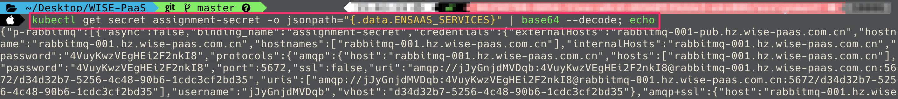
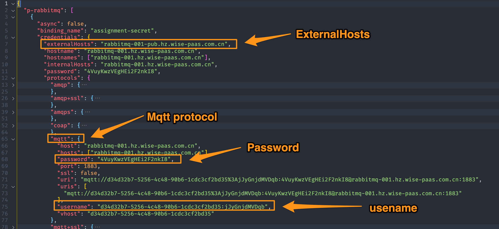
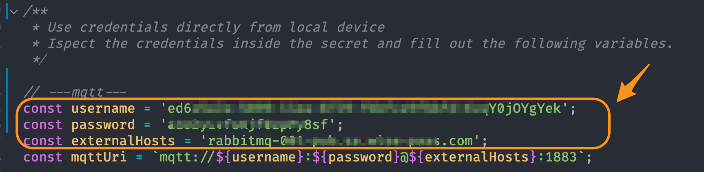
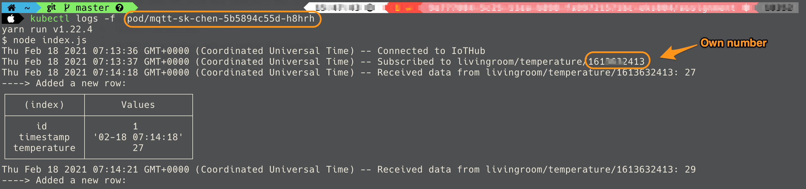
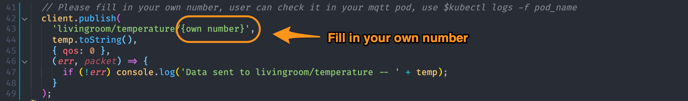

# Edge-Mock-Temperature

This app keeps publishing mock temperature data through WISE-PaaS IoT-Hub to simulate the edge sensor.

## 1. Inspect the credentials JSON file decoded from the secret 

1. Secret name use "assignment-secret" and then decode secret
```script
kubectl get secret {secret_name}  -o jsonpath="{.data.ENSAAS_SERVICES}" | base64 --decode; echo
```


2. Save as json format in vscode


3. Set up MQTT credentials 


## 2. Confirm your own number
check your pod logs will get your own number


## 3. Fill in your number and push messages to your topic



