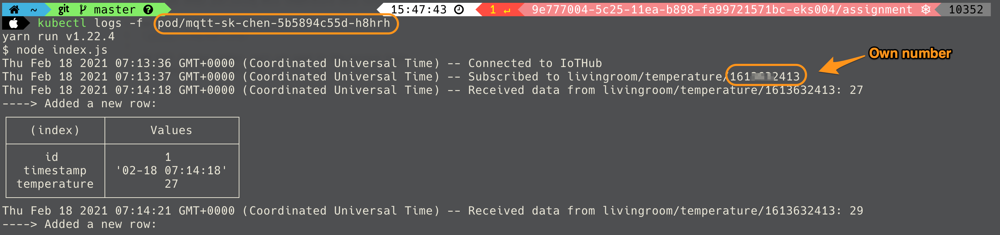

# Edge-Mock-Temperature

This app keeps publishing mock temperature data through WISE-PaaS IoT-Hub to simulate the edge sensor.

## 1. Inspect the credentials JSON file decoded from the secret 

## 2. Confirm your own number
check your pod logs will get your own number

## 3. Fill in your number and push messages to your topic

